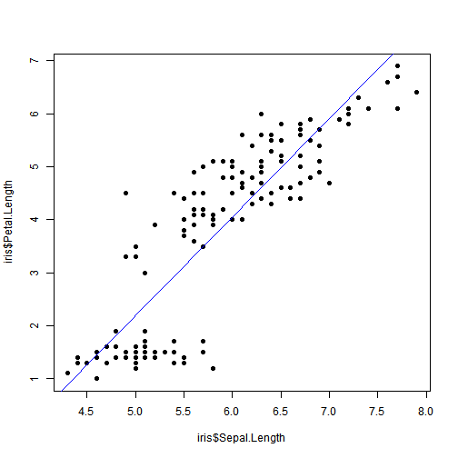

--- .class #id 

## The iris dataset

The iris dataset is a collection of measurements gathered from 
50 flowers of 3 different species.

This dataset is bundled with R, and can be examined with the `iris` variable.

The following variables are available in the dataframe:


```r
names(iris)
```

```
## [1] "Sepal.Length" "Sepal.Width"  "Petal.Length" "Petal.Width" 
## [5] "Species"
```

---
## The iris dataset

Here is a summary of the dataframe:


```r
summary(iris)
```

```
##   Sepal.Length   Sepal.Width    Petal.Length   Petal.Width 
##  Min.   :4.30   Min.   :2.00   Min.   :1.00   Min.   :0.1  
##  1st Qu.:5.10   1st Qu.:2.80   1st Qu.:1.60   1st Qu.:0.3  
##  Median :5.80   Median :3.00   Median :4.35   Median :1.3  
##  Mean   :5.84   Mean   :3.06   Mean   :3.76   Mean   :1.2  
##  3rd Qu.:6.40   3rd Qu.:3.30   3rd Qu.:5.10   3rd Qu.:1.8  
##  Max.   :7.90   Max.   :4.40   Max.   :6.90   Max.   :2.5  
##        Species  
##  setosa    :50  
##  versicolor:50  
##  virginica :50  
##                 
##                 
## 
```

---

## Linear correlations

When anlysing the whole dataset, there seems to be some positive linear correlation
between Sepal and Petal Length:

 

---

## Linear correlations

But when we partition the data between the three different species, we can see that
this correlantion is higher:

 
